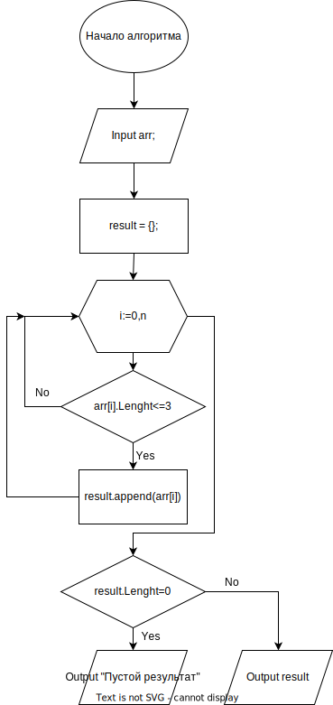

# Итоговая проверочная работа
## Суть задачи
Написать программу, которая из имеющегося массива строк формирует массив из строк,длинна которых меньше либо равна 3 символа. Массив можно ввести с клавиатуры, либо задать на старте выполнения алгоритма.

## Блок-схема алгоритма

